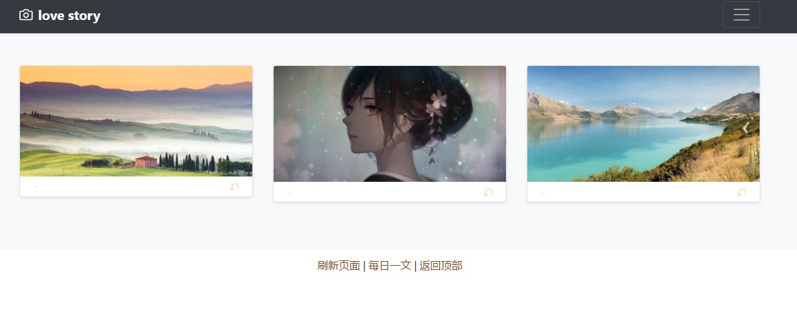

# Shared_Photo_Albums
这是一个Flask搭建的云共享相册，支持在线上传，删除，恢复图片，支持一键清空回收站

#### 主页样例如下


#### 网站分为四个页面
- 页面一：主页
- 页面二：回收站
- 页面三：每日一文
- 页面四：清空站
- 页面五：所有上传的图片

#### 使用问题
由于日常生活中基本上只能用到页面一和页面二和页面三，所以页面四和页面五被隐藏起来了，细心的道友仔细寻找可以发现

#### 新增功能
- 主页图片旋转功能，支持局部刷新；
- 直接从页面上删除/恢复照片，支持局部刷新；
- 上传照片提示等待功能；
- 上传照片重定向微信页面访问bug修复；
- 支持清空站/所有照片彻底删除的功能；
- 删除/恢复照片提示功能；
- 详情页功能

#### 函数都放在view.py这个文件里面
用于视图函数的书写，把整个项目的入口变得更加简洁，把函数代码归类到一起

#### 增加删除与旋转必须输入口令


#### 项目运行
项目中有两个运行文件
- run.py
- run.sh

运行方法一：
```
python3 run.py
```

运行方法二：
```
./run.sh
```
